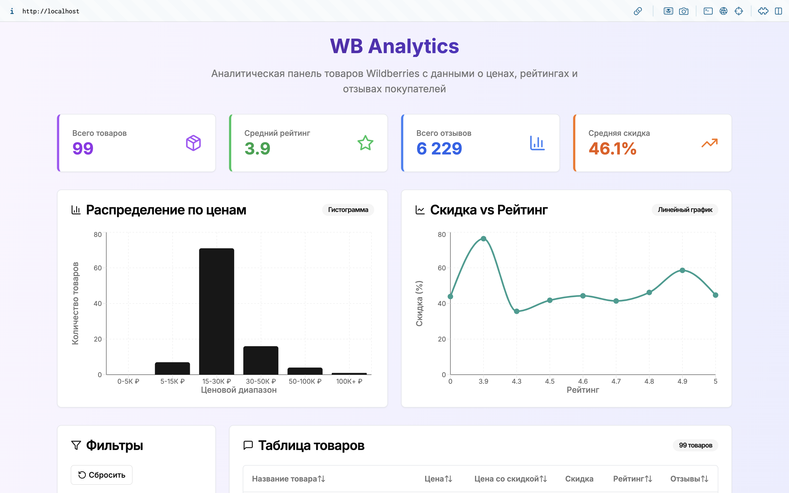
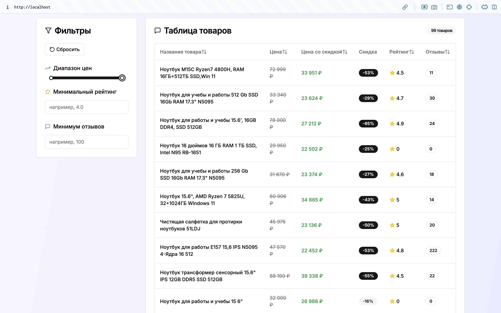

# WB Analytics

[](https://www.python.org/)
[](https://www.djangoproject.com/)
[](https://reactjs.org/)
[](https://nextjs.org/)
[](https://www.docker.com/)
[](https://www.postgresql.org/)
[](LICENSE)

WB Analytics is a powerful tool for analyzing products from the Wildberries marketplace. It provides comprehensive insights and data visualization capabilities to help sellers optimize their product offerings.

<div align="center">
  
</div>




## Tech Stack

**Backend:**

- Python 3.13+
- Django (REST API)
- PostgreSQL (database)

**Frontend:**

- Next.js (React)
- Tailwind CSS
- Radix UI

## Project Structure

- `backend/` - Django backend API
- `frontend/` - Next.js frontend
- `deployments/` - Docker configuration for development and production environments

---

## Makefile Commands

All Makefile commands default to development environment (`ENV=dev`). To use production environment, append `ENV=prod` to any command:

## Production Setup (Quick Start)

### Prerequisites

Before you begin, ensure you have the following installed:

- [Git](https://git-scm.com/downloads)
- [GNU Make](https://www.gnu.org/software/make/)
- [Docker](https://docs.docker.com/get-docker/) and [Docker Compose](https://docs.docker.com/compose/install/)

### 1. Clone the repository

```bash
git clone https://github.com/teenxsky/wb-analytics.git
cd wb-analytics
```

### 2. Set up environment variables

```bash
cd deployments/prod/conf
cp .env .env.local
```

Edit the `.env.local` file with your settings.

### 3. Build and start the production environment

All commands are made from the root of the project

```bash
make build ENV=prod
make up ENV=prod
```

### 4. Initialize the application

After containers are running:

1. Create admin user:

```bash
make createsuperuser ENV=prod
```

2. Import Wildberries products:
- Via admin panel:

```
http://api.localhost/admin/products/product/parse_wb/
```

- Or via CLI:

```bash
make parse-wb-products query=<your search query: str> pages=<page count: int> limit=<products per page: int>
```

### 5. Access the application

- Frontend: http://localhost:80/

- Backend API: http://api.localhost:80/
- Admin panel: http://api.localhost:80/admin/
- Swagger UI: http://api.localhost:80/v1/docs/

### Common Commands

- View logs:

  ```bash
  make up-logs ENV=prod
  ```

- Stop containers:

  ```bash
  make clean ENV=prod
  ```

- Full cleanup (including volumes):

  ```bash
  make clean-volumes ENV=prod
  ```

- Show all available commands:
  ```bash
  make help
  ```

---

## Key Features

- Product performance analytics from Wildberries
- Interactive charts and data visualization
- Product comparison tools
- Market trend analysis
- Custom reporting

## Development Setup

For development instructions, see [DEV_GUIDE.md](DEV_GUIDE.md).

## License

Apache License 2.0 - see [LICENSE](LICENSE) for details.
